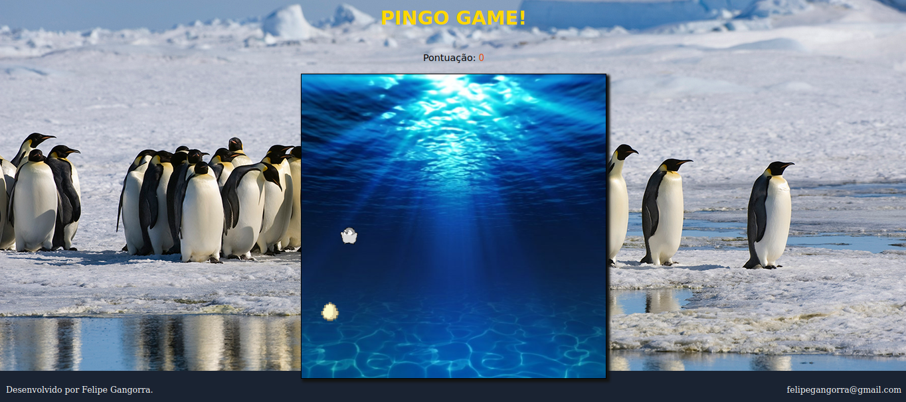

# Pingo-Game 🐧

Jogo de navegador baseado no jogo da cobrinha.

>Linguagens/Ferramentas: HTML, CSS e JavaScript

 

### HISTÓRIA 📖

Pingo é um jovem pinguim que acabou chocando primeiro que seus irmãos em meio a tempestade na costa da Antártica. Pingo olha ao seu redor e não encontra seus pais, ela não encontra nenhum sinal de vida fora seus irmãos.
Em meio a tempestade e as ventanias os ovos dos pingos acabam rolando ladeira abaixo e caindo no mar, onde há focas e leões marinhos que querem devorar os pingos...

Sua missão é ajudar Pingo a resgatar seus irmãos indefesos em alto mar, boa sorte. 😃

Link🔗: [Pingo Game](https://felipegangorra.github.io/pingo-game/)

